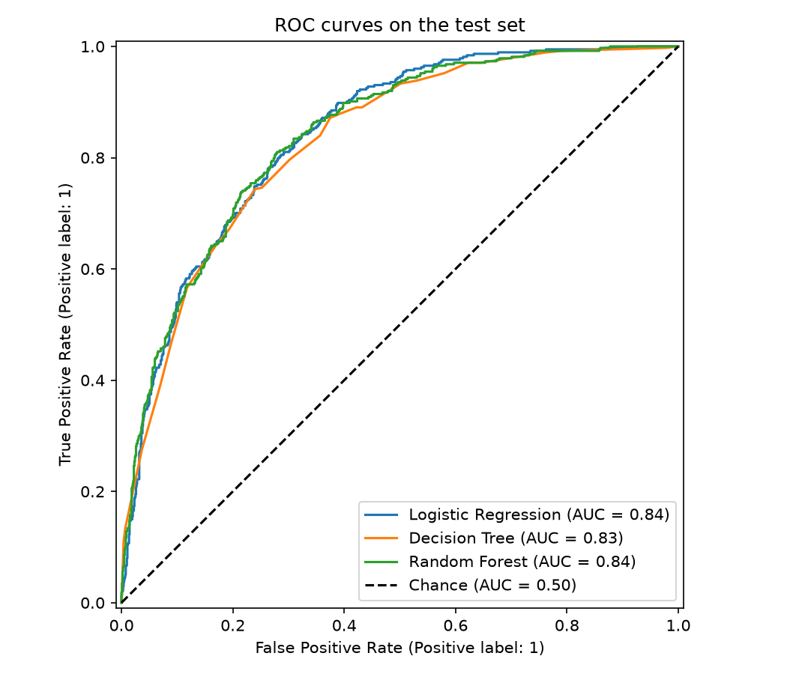
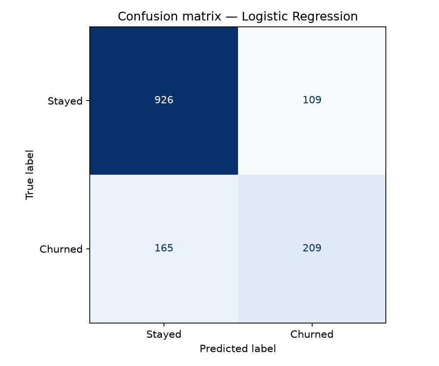
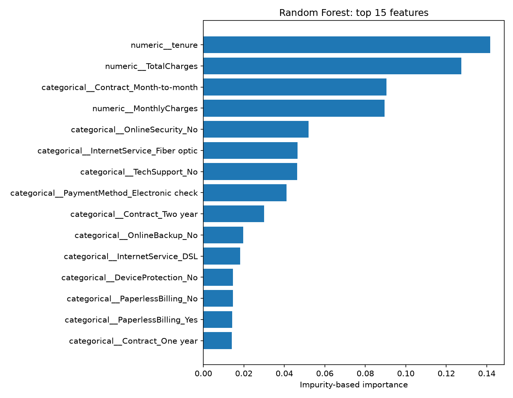

# Customer Churn Prediction

## Overview

Telecom companies lose revenue when customers cancel their subscriptions. This
project explores customer characteristics associated with churn and compares
three machine-learning classifiers. An EDA notebook presents the observations,
and Python scripts handle preprocessing, training, evaluation, and model saving.

## Dataset

The [IBM Telco Customer Churn dataset](https://github.com/IBM/telco-customer-churn-on-icp4d/blob/master/data/Telco-Customer-Churn.csv)
is included in `data/telco_churn.csv`. It contains demographic, subscription,
service, and account information.

- Original shape: **7,043 rows × 21 columns**.
- After cleaning: **7,043 rows × 20 columns**, including 19 features and the target.
- Target: `Churn`, mapped from `Yes` to 1 and `No` to 0.
- Churned: **1,869 customers (26.54%)**; stayed: **5,174 (73.46%)**.

There are no exact duplicate rows. Duplicate checks happen before removing
`customerID`, so different customers with identical attributes are retained.
`TotalCharges` contains 11 blank entries, all for customers with zero tenure.
`pd.to_numeric(errors="coerce")` converts these to missing values, which are
filled by a training-only median imputer. No customers are dropped.

## Project Workflow

1. Clean the data and separate features from the target.
2. Explore churn patterns in the notebook.
3. Create a stratified 80/20 train/test split with `random_state=42`.
4. Fit preprocessing and each classifier together in a scikit-learn `Pipeline`.
5. Compare models and select the highest test ROC-AUC.
6. Save the selected pipeline, evaluation reports, and interpretation figures.

The split contains **5,634 training customers** and **1,409 test customers**.
Stratification keeps the churn proportion similar in both sets.

Columns are identified by data type: **4 numerical** features use median
imputation and `StandardScaler`; **15 categorical** features use
`OneHotEncoder(handle_unknown="ignore")`. `SeniorCitizen` remains a numeric
binary indicator. A `ColumnTransformer` produces **45 transformed features**.
All preprocessing is fitted only on training data.

## Exploratory Data Analysis

[`notebooks/01_eda.ipynb`](notebooks/01_eda.ipynb) includes executed outputs,
data-quality checks, and nine charts covering overall churn, contract type,
internet service, payment method, senior citizen status, tenure, monthly charges,
technical support, and online security. Each chart has a short interpretation.
The analysis describes associations across the full dataset.

## Models

All models use `random_state=42`:

- **Logistic Regression:** `max_iter=1000`
- **Decision Tree:** `max_depth=5`
- **Random Forest:** `n_estimators=200`, `max_depth=10`, `n_jobs=-1`

The project uses fixed settings without hyperparameter search, resampling, or
class weighting.

## Evaluation Metrics

- **Accuracy:** proportion of all predictions that are correct.
- **Precision:** proportion of predicted churners who actually churned.
- **Recall:** proportion of actual churners identified by the model.
- **F1-score:** harmonic mean of precision and recall.
- **ROC-AUC:** how well probabilities rank churners above non-churners across
  thresholds.

Precision, recall, and F1-score refer to **Churn = 1**. Classification uses the
default 0.5 probability threshold. Accuracy alone is insufficient: predicting
that every customer stays would achieve 73.46% accuracy on the full dataset.

## Results

Results from the latest successful `python main.py` run, rounded to four decimal
places. Full-precision values are in
[`reports/model_comparison.csv`](reports/model_comparison.csv).

| Model | Accuracy | Precision | Recall | F1-score | ROC-AUC |
| --- | ---: | ---: | ---: | ---: | ---: |
| Logistic Regression | 0.8055 | 0.6572 | 0.5588 | 0.6040 | 0.8419 |
| Decision Tree | 0.7984 | 0.6347 | 0.5668 | 0.5989 | 0.8303 |
| Random Forest | 0.8027 | 0.6633 | 0.5214 | 0.5838 | 0.8410 |



## Best Model

**Logistic Regression** was selected because it has the highest test ROC-AUC
(**0.8419**). It also has the highest F1-score (**0.6040**) on this split, with
accuracy of **0.8055**. Its ROC-AUC lead over Random Forest (**0.8410**) is small.

The complete training-fitted pipeline is saved as `models/churn_model.joblib`.
It includes imputation, scaling, encoding, and the classifier; it is not refitted
on the full dataset.



## Key Insights

- Month-to-month customers have **42.71%** churn, versus **11.27%** for one-year
  and **2.83%** for two-year contracts.
- Customers with 0–12 months of tenure have **47.44%** churn, compared with
  **9.51%** for those with 49–72 months.
- Average monthly charges are **74.44** for churned customers and **61.27** for
  customers who stayed.
- Fiber-optic customers have **41.89%** churn, and electronic-check customers
  have **45.29%**—the highest rates within their respective categories.
- Churn is **41.64%** without technical support versus **15.17%** with support,
  and **41.77%** without online security versus **14.61%** with security.

These comparisons do not control for other customer characteristics and do not
establish that changing a service would prevent churn.

## Feature Importance

The Random Forest's five highest impurity-based importances are:

| Transformed feature | Importance |
| --- | ---: |
| tenure | 0.1416 |
| TotalCharges | 0.1275 |
| Contract: Month-to-month | 0.0905 |
| MonthlyCharges | 0.0894 |
| OnlineSecurity: No | 0.0519 |



The full ranking is in [`reports/feature_importance.csv`](reports/feature_importance.csv).
These values describe the Random Forest, not the selected Logistic Regression.
**Feature importance does not imply causation** or show effect direction.
Impurity-based importance can favor continuous features and distribute importance
across correlated or one-hot-encoded features.

## Project Structure

```text
customer-churn-prediction/
├── data/
│   └── telco_churn.csv
├── notebooks/
│   └── 01_eda.ipynb
├── src/
│   ├── data_preparation.py
│   ├── train.py
│   └── evaluate.py
├── models/
│   └── churn_model.joblib
├── reports/
│   ├── figures/
│   │   ├── confusion_matrix.png
│   │   ├── roc_curve.png
│   │   └── feature_importance.png
│   ├── model_comparison.csv
│   ├── classification_report.txt
│   └── feature_importance.csv
├── requirements.txt
├── .gitignore
├── README.md
└── main.py
```

`data_preparation.py` handles cleaning and preprocessing; `train.py` fits the
models; `evaluate.py` calculates metrics and creates figures. `main.py` connects
these steps and saves the outputs.

## Installation

Tested with **Python 3.14.7**. `requirements.txt` specifies dependency version
ranges, so installations may resolve to different versions.

Replace `YOUR_USERNAME` with the repository owner's username after publishing.
If the folder is already downloaded, skip the clone command.

```bash
git clone https://github.com/YOUR_USERNAME/customer-churn-prediction.git
cd customer-churn-prediction
python -m venv .venv
```

Activate on Linux/macOS:

```bash
source .venv/bin/activate
```

Activate on Windows (Command Prompt):

```bat
.venv\Scripts\activate
```

Install dependencies:

```bash
pip install -r requirements.txt
```

## How to Run

From the project folder with the virtual environment activated:

```bash
python main.py
```

This trains all three models, prints their metrics and the selected model's
classification report, and regenerates the saved pipeline, report files, and
three evaluation figures.

Open the executed EDA notebook with:

```bash
jupyter notebook notebooks/01_eda.ipynb
```

## Technologies Used

Python, pandas, NumPy, Matplotlib, scikit-learn, joblib, and Jupyter.

## Limitations

- The same test set is used to compare models and select the winner, so it is
  not an untouched final evaluation after selection. There is no cross-validation,
  and the EDA describes the full dataset.
- The selected model's recall is **0.5588**: it misses **165 of 374** test-set
  churners at the default threshold.
- The **0.5** threshold is not tuned to retention costs or a recall target.
- One random split does not establish performance on future customers. There is
  no time-based validation or defined future prediction horizon.

## Future Improvements

- Reserve a final holdout before EDA and use training-only cross-validation for
  model selection.
- Choose a threshold on validation data based on the precision/recall tradeoff
  and estimated outreach costs.
- Add permutation importance and examine Logistic Regression coefficients.
- Evaluate performance across customer groups and over time if suitable data
  becomes available.
